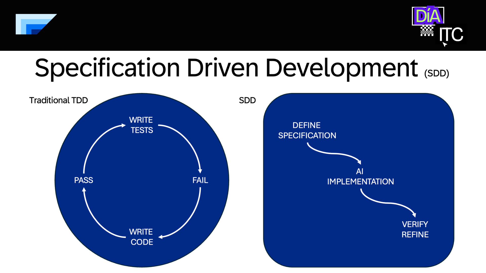

# Live Demo — Stock Price MCP Server

This section covers the **live demonstration** of the workshop. The goal is to build a standalone MCP server from scratch using the **Specification Driven Development (SDD)** methodology.

---

## What We Are Building

A **standalone MCP server** that exposes one tool:

| Tool | Description |
|------|-------------|
| `get_stock_price` | Accepts a stock ticker (e.g. `AAPL`, `MSFT`) and returns the latest market price |

The server uses:
- **FastMCP** — Python framework for building MCP servers
- **yfinance** — fetches stock data from Yahoo Finance (no API key needed)
- **HTTP Streamable** transport — testable with MCP Inspector and connectable to Cline

---

## Project Structure (to be created)

```
04_live_demo/
├── server.py                  # MCP server (HTTP on port 8002)
├── skills/
│   └── yfinance_skill.py      # Skill with get_stock_price(ticker) function
├── instructions.md            # SDD specification (the blueprint)
└── README.md                  # This file
```

---

## Specification Driven Development (SDD)

> A methodology where you start with clear specifications and use AI to accelerate implementation while maintaining quality standards.



### The 3 Phases

| Phase | Description |
|-------|-------------|
| **1. Specification First** | Define requirements, acceptance criteria, and edge cases before writing code |
| **2. AI-Assisted Implementation** | Hand the spec to an AI agent (e.g. Cline) to generate the implementation |
| **3. Validation & Verification** | Test against the spec — not against assumptions |

### SDD Best Practices

- **Given / When / Then** format for acceptance criteria
- Include **edge cases** explicitly in the spec
- **AI assists, humans decide** — AI proposes code, humans approve
- **Iterate** — start simple, add complexity gradually, verify at each step
- **Spec lives in the repo** — `instructions.md` is the single source of truth

---

## How to Use This Demo

### Step 1 — Read the Spec

Open [`instructions.md`](instructions.md) and review the full SDD specification. It defines:
- What the tool does
- Input/output format
- Edge cases
- File structure
- Code pseudocode for the server and skill

### Step 2 — Implement with AI

Hand the spec to Cline (or any AI agent) and ask it to implement it:

> "Implement the spec in `04_live_demo/instructions.md`. Create the server and skill files as described."

The AI will:
1. Create `04_live_demo/skills/yfinance_skill.py`
2. Create `04_live_demo/server.py`
3. Add `yfinance` to `00_setup/requirements.txt`

### Step 3 — Run the Server

```bash
# Install dependencies
pip install -r 00_setup/requirements.txt

# Start the server (HTTP mode — default, port 8002)
python 04_live_demo/server.py
```

The MCP endpoint will be available at: `http://localhost:8002/mcp`

### Step 4 — Test with MCP Inspector

```bash
# Option A — STDIO mode (single command)
npx @modelcontextprotocol/inspector python3 04_live_demo/server.py --transport stdio

# Option B — HTTP mode (two terminals)
# Terminal 1: python3 04_live_demo/server.py
# Terminal 2: npx @modelcontextprotocol/inspector
# In browser: Transport Type = "Streamable HTTP", URL = http://localhost:8002/mcp
```

### Step 5 — Connect to Cline

Add to your Cline MCP settings:

```json
{
  "mcpServers": {
    "stock-price-server": {
      "disabled": false,
      "timeout": 60,
      "type": "streamableHttp",
      "url": "http://localhost:8002/mcp"
    }
  }
}
```

---

## Expected Tool Behavior

**Call:**
```json
{ "ticker": "AAPL" }
```

**Response:**
```json
{
  "ticker": "AAPL",
  "name": "Apple Inc.",
  "price": 198.52,
  "currency": "USD"
}
```

**Error (invalid ticker):**
```json
{
  "error": "Could not find data for ticker 'XYZNOTREAL123'."
}
```

---

## Dependencies

| Package | Purpose |
|---------|---------|
| `fastmcp` | Framework for building MCP servers in Python |
| `yfinance` | Yahoo Finance data (stock prices, no API key needed) |

